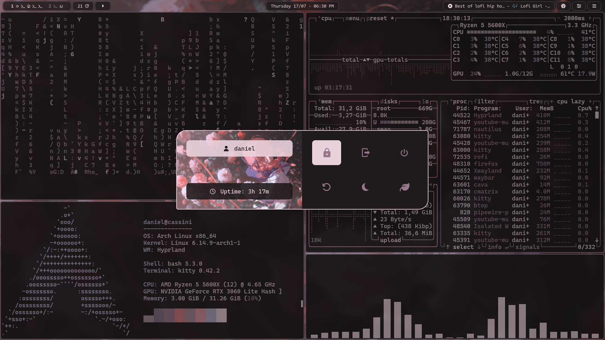
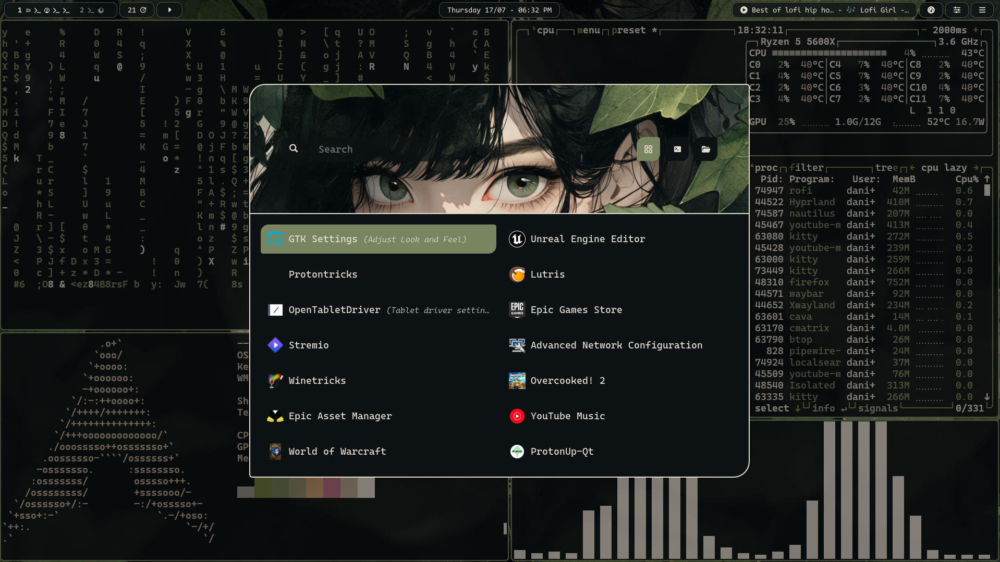
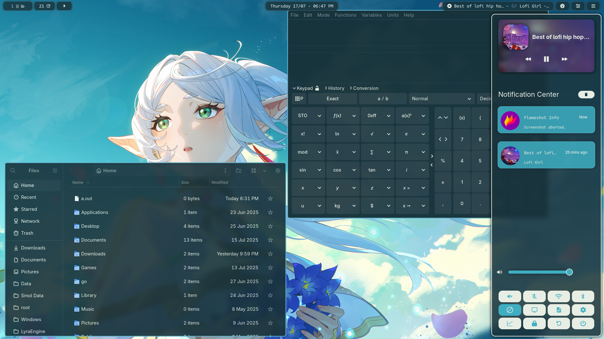
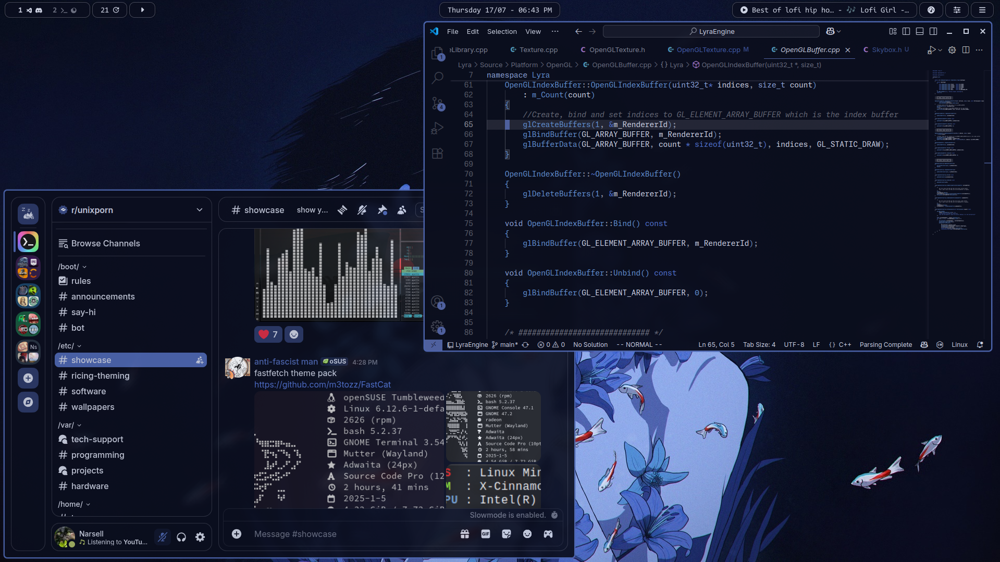

# Arch hyprland rice

  
  

**[All screenshots](./screenshots/)**

## Disclaimer
This is not a plug and play rice by any means. There's no install script or thoroughly explained step-by-step tutorial.

You should sort of know how this goes, but if you don't, feel free to open an issue and I'll try to help you.

## How to Use
I've setup the repo in a way that makes it easy to get a specific config applied into your system using stow.

To apply a config, pick one of the modules by looking at the root directory names, that's the name you'll have to input into stow. 

Let's say you want to copy the kitty config into your system.
 
### Prerequisites
- Ensure you have a working kitty setup in place 
- Install stow.
- Clone the repository and cd into it.
- Almost everything here uses pywal colors, so ensure you have a working pywal setup too, or copy the wal config first to ensure you have the correct templates being generated.

As I mentioned, we will use stow to create symlinks to the appropiate config directories for the module you've selected.

```
stow -t ~ kitty
```

That's it, you should now have config files at `~/.config/kitty`

## Considerations
- Some of these configs have dependencies between them, so be aware of that.
- The rofi directory is not present here because rofi config files are generated by pywal. You can find them at `./wal/.config/wal/templates`. To get rofi working with those templates:
    - `stow -t ~ wal`
    - Generate pywal colors so rofi configs get put in `~/.cache`
    - `stow -t ~ scripts`
    - `chmod +x ~/scripts/setup_symlinks.sh`
    - `~/scripts/setup_symlinks.sh`
- Many rofi menus use custom shell scripts so definitely checkout `/scripts`